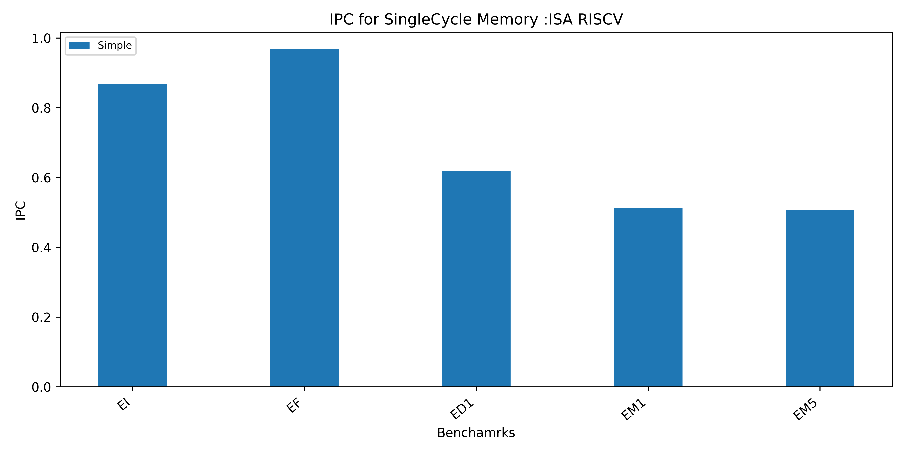
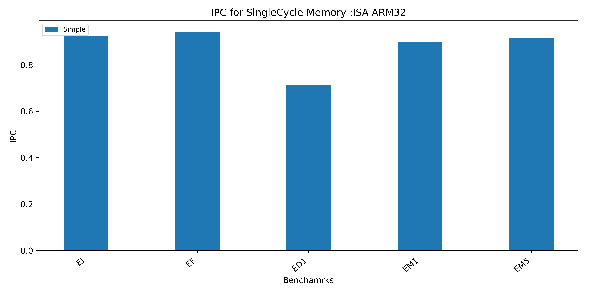

## Finding the Instruction-mix based on IPC ##

The SimpleTiming CPU is a simple single stage CPU whose IPC is dependent only on the memory and fetch latency.

So when the latency is single cycle and the total number of cycles is equal to the number of instruction fetches and mem refs, can we find the instruction mix from the IPC or vice versa as below?

``` 
    IPC = Number of instructions/(Number of Inst + Number of mem_ref)
        = 1/(percent_of_arithmetic_instructions + 2* percent_of_mem_refs)```

It is possible to calculate the IPC, but the number of instruction fetches per instruction depends on the underlying ISA.


### ISA-X86 ###

Each fetch request in SimpleTiming CPU is modeled to fetch 32 bit per fetch request. The X86 ISA has variable length instrcutions,some instructions might take multiple fetch before a complete instruction could be fetched.Therefore the number of instruction fetches made by the CPU is more than the number of instructions in the code.Hence,it is not possible to calculate the exact instruction mixture from just the IPC.


| Benchmarks | Num of Inst | Num of mem_refs | Expected IPC | IPC  |
|------------|-------------|-----------------|--------------|------|
| EI         | 16449       | 2392            | 0.87         | 0.65 |
| EF         | 47108       | 2402            | 0.95         | 0.69 |
| ED1        | 26606       | 2386            | 0.91         | 0.75 |
| EM1        | 22507       | 2386            | 0.90         | 0.72 |
| EM5        | 38899       | 2386            | 0.94         | 0.69 |
 


### ISA-RISCV ###

Each fetch request in SimpleTiming CPU fetches 32 bit per fetch. The RISCV ISA supports unaligned instructions and  compressed unaligned instruction. The Unaligned instruction might require two fetches before a complete instruction could be fetched in gem5 model. Therefore the calculation  of exact instruction mixture from just the IPC might not be accurate when there are mixture of unaligned and aligned instructions present in the code.

| Benchmarks | Num of Inst | Num of mem_refs | Expected IPC | IPC  |
|------------|-------------|-----------------|--------------|------|
| EI         | 35021       | 876             | 0.97         | 0.81 |
| EF         | 43215       | 892             | 0.98         | 0.96 |
| ED1        | 2240        | 876             | 0.72         | 0.61 |
| EM1        | 18617       | 876             | 0.95         | 0.52 |
| EM5        | 35010       | 876             | 0.97         | 0.50 |





### ISA-ARM ###

Each fetch request in SimpleTiming CPU fetches 32 bit per fetch. ARM has a fixed length instruction of 32 bits, therefore we can calculate the exact instruction mixture from just the IPC.

| Benchmarks | Num of Inst | Num of mem_refs | Expected IPC | IPC  |
|------------|-------------|-----------------|--------------|------|
| EI         | 46260       | 3835            | 0.92         | 0.92 |
| EF         | 737813      | 44810           | 0.94         | 0.94 |
| ED1        | 9357        | 3842            | 0.71         | 0.71 |
| EM1        | 33915       | 3834            | 0.90         | 0.90 |
| EM5        | 42118       | 3836            | 0.91         | 0.91 |





