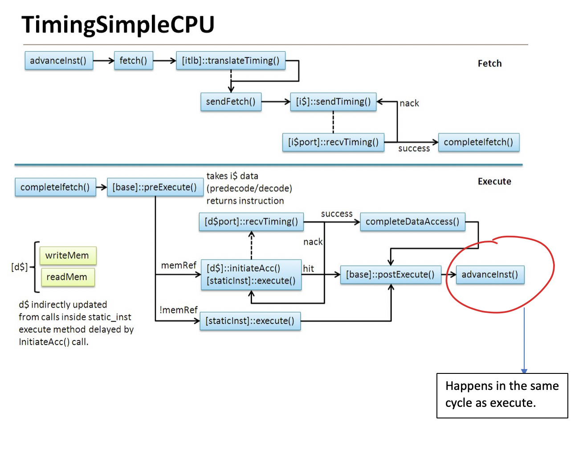

## **Timing Simple CPU:**

### Execution benchamarks:

- EI  : 8 Independent Instructions
- EF  : 16 Independent Instructions
- ED1 : 1 Dependency Chain per instruction
- EM1 : 1 dependency chain with multiplies
- EM5 : 5 dependency chain with multiplies

### Memory Latency:

- Inf : Perfect memory, it takes ‘0ns’ for any memory access.
- SingleCycle : It takes '1ns' for any memory access.

### Simple_Timing CPU

The TimingSimpleCPU is the version of SimpleCPU that uses timing memory accesses. It has a 2 stage pipeline, (Fetch + Execute).
The timing simple advances to "next fetch" in the same cycle as the "execute" stage.

**The Timing Simple in Single cycle** 

Since exceute and next-fetch happens at the same time, without memory latency, it takes only the inital latency for fetch and every execution happpens at zero time and the entire benchmark executes in 1 or 2 cycels, which gives a very high IPC.

**The Timing Simple in Single cycle**

Since this is a execution benchmark suite with only airthmetic independent instruction, the latency we see is only because of fetch.

In single-Cycle memory bandwidth, the memory access to fetch takes 1 cycle and hence IPC ~1. 

**Conclusion**

[TimingSimple](http://www.gem5.org/documentation/general_docs/cpu_models/SimpleCPU) is an in-order 2 stage simple CPU, mainly used to measure the memory latency involved in benchmarks.

