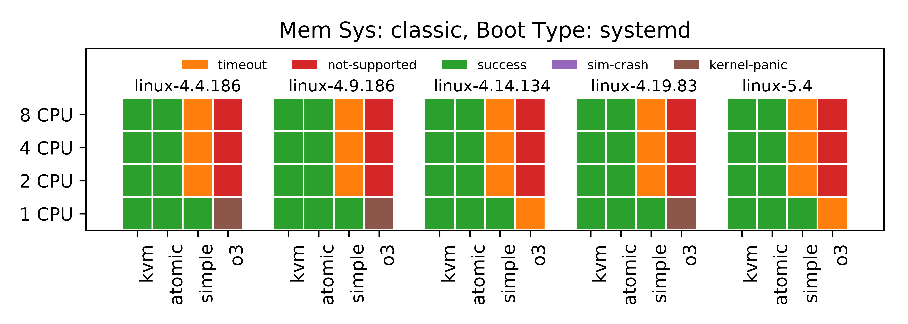
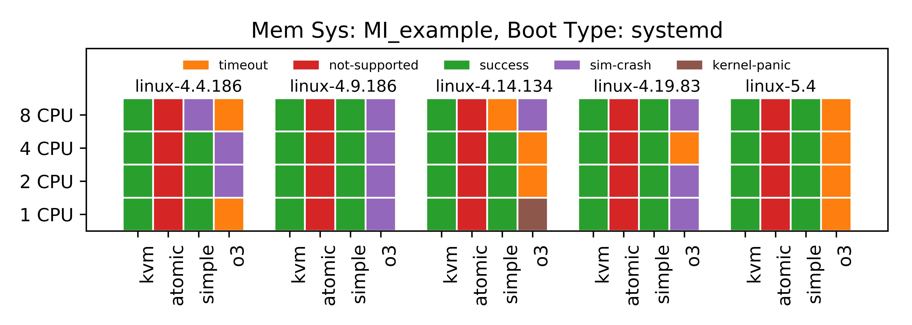
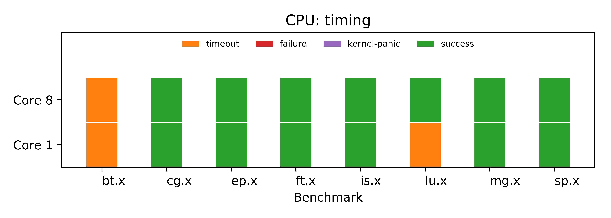
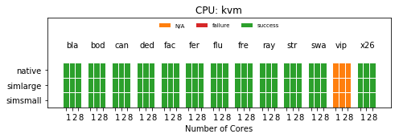
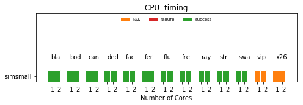
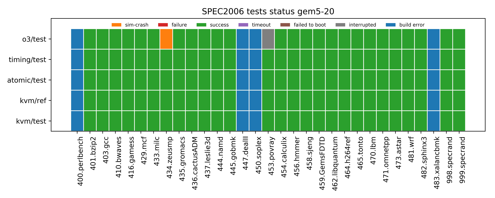

# Working Status of Benchmarks

This page provides information on the working status of some benchmark suites with gem5-20.

# Boot Tests

The Linux Kernel boot tests rely on 5 LTS kernel releases (4.4.186, 4.9.186, 4.14.134, 4.19.83, and 5.4), four CPU models (kvmCPU, AtomicSimpleCPU, TimingSimpleCPU, O3CPU), three memory systems (classic, MI_Example, MESI_Two_Level) and two boot types (init, systemd).

Following is the description of the possible status of these runs:

**timeout:** experiment did not finish in a reasonable amount of time (12 hours: this time was chosen as we found similar successful cases did not exceed this limit on the same host machine).

**not-supported:** cases which are not yet supported in gem5.

**success:** cases where Linux booted successfully.

**sim-crash:** cases where gem5 crashed.

**kernel-panic:** cases where kernel went into panic during simulation.

**Summary:** kvmCPU works in all cases.
AtomicSimpleCPU works fine with Classic memory system, but it is not supported with any Ruby protocols.
TimingSimpleCPU always work for a single CPU core in case of Classic memory system, but fails to complete the booting process in the alloted time for more than one CPU cores.
TimingSimpleCPU mostly works for any number of CPU cores for Ruby memory protocols except one case with MI_example and seven cases with MESI_Two_Level protocols, where gem5 crashes.
However, all of these crashes show an error that the cache controller's packet queue has grown beyond 100 packets.
It is expected that recompiling gem5 after changing the default packet queue size to a bigger value will lead these simulations to work fine.
For O3CPU, the Classic memory system is considered to not support more than one CPU core and with a single CPU core it works successfully in less than half of the cases and either shows kernel panic or simulation times out in the rest of the cases.
For Ruby memory protocols as well, O3CPU simulations do not work in all the cases (except one), but either times out or show kernel panic or crash.
The O3CPU (with Ruby) cases where simulations crash, the errors point to possible deadlocks or segmentation faults.

# NPB Tests

These NPB tests use KVM CPU (1,8,16,32, and 64 cores) and TimingSimple CPU (1 and 8 cores) with MESI_Two_Level memory system.

It is a known problem that if the number of simulated CPU cores increase, KVM simulations get stuck sometimes.
A work around is to use lower number of event queues than the CPU cores.
Although our scripts do that for more than 1 CPU core, the cases shown as `timeout` in the plot above
suffer from this problem of getting stuck.

There are three cases with TimingSimple CPU which did not finish in the alloted time.
There is no reason apparent in the generated results files (`simout`, `simerr`, `system.pc.com_1.device`).

## PARSEC Tests

The PARSEC Experiments have been run with the following configurations:

* KVM CPU model: Ruby Memory System + MESI_Two_Level + [`simsmall`, `simlarge`, `native`] sizes + [`1`, `2`, `8`] cores.

* TimingSimple CPU model: Ruby System + MESI_Two_Level + [`simsmall`] size + [`1`, `2`] cores.

The result of experiments with gem5-20 is shown below:

The cases of unsuccessfull termination of simulation are shown below:

* Corrupted Input: When running experiments using `vips` workload, simulation does not start because the inputs to the workload are corrupted.
* Stack Smashing Detected: When running workload `x264` with TimingSimple CPU model, the simulation stops because a stack smashing attack is detected.

# SPEC 2006 Tests

The following plot represent the status of SPEC2006 workloads for different CPUs and data sizes with respect to gem5-20, linux kernel version 4.19.83 and gcc version 7.5.0.

* **434.zeusmp** had crashed in gem5-19 and gem5-20 segmentation fault.
* **453.povray** needs a rerun and the test with gem5-19 was a success. 

# SPEC 2017 Tests

The following plot represent the status of SPEC2017 workloads with respect to gem5-20, linux kernel version 4.19.83 and gcc version 7.5.0.

* **600.perlbench_s** kernel panic while booting, couldn't find a reason.

# GAPBS Tests